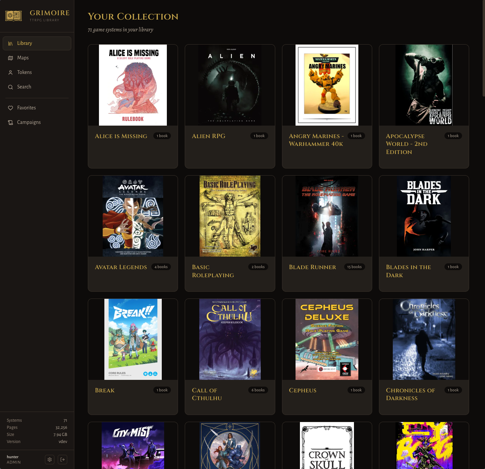
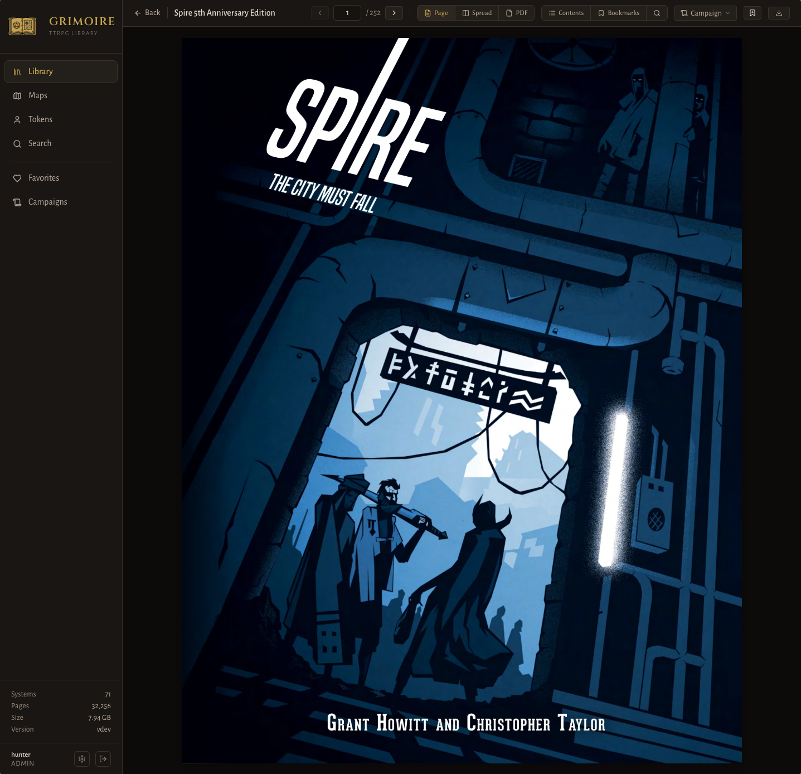
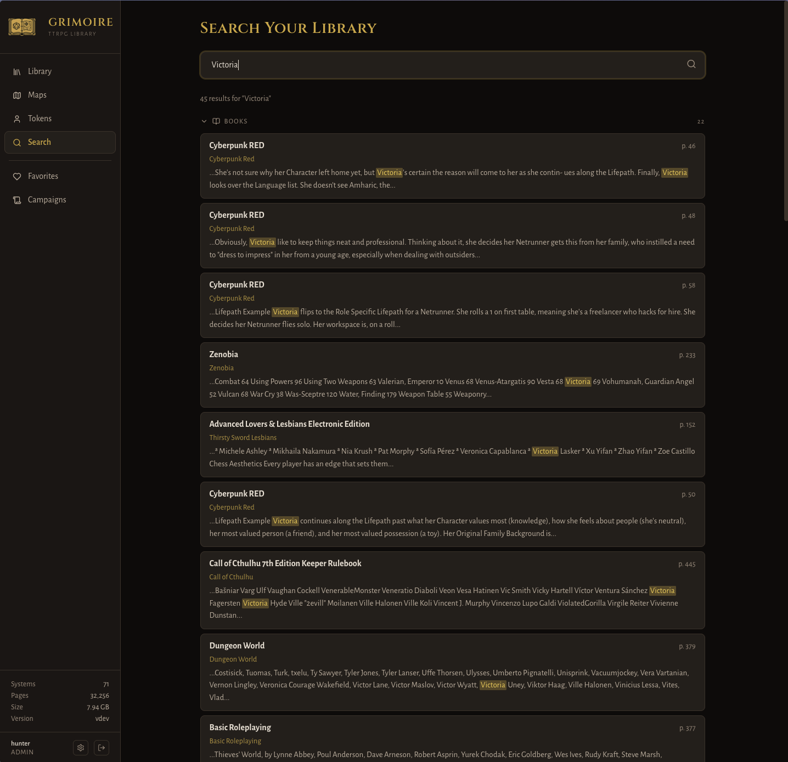
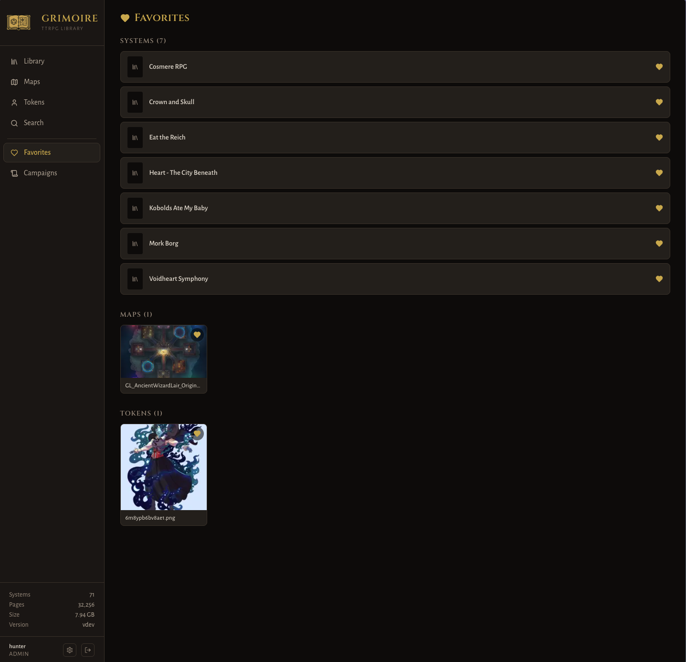
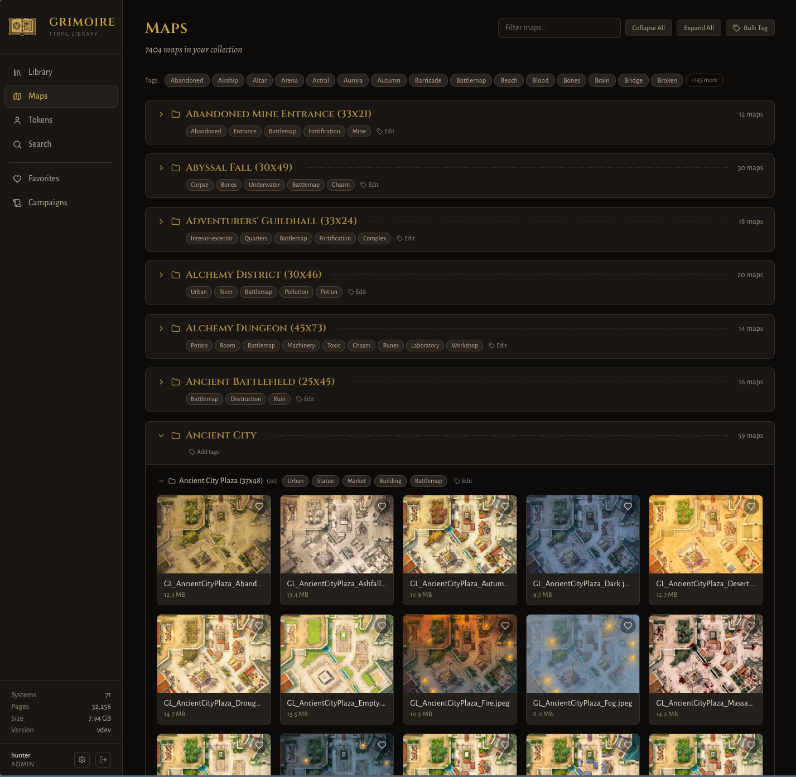
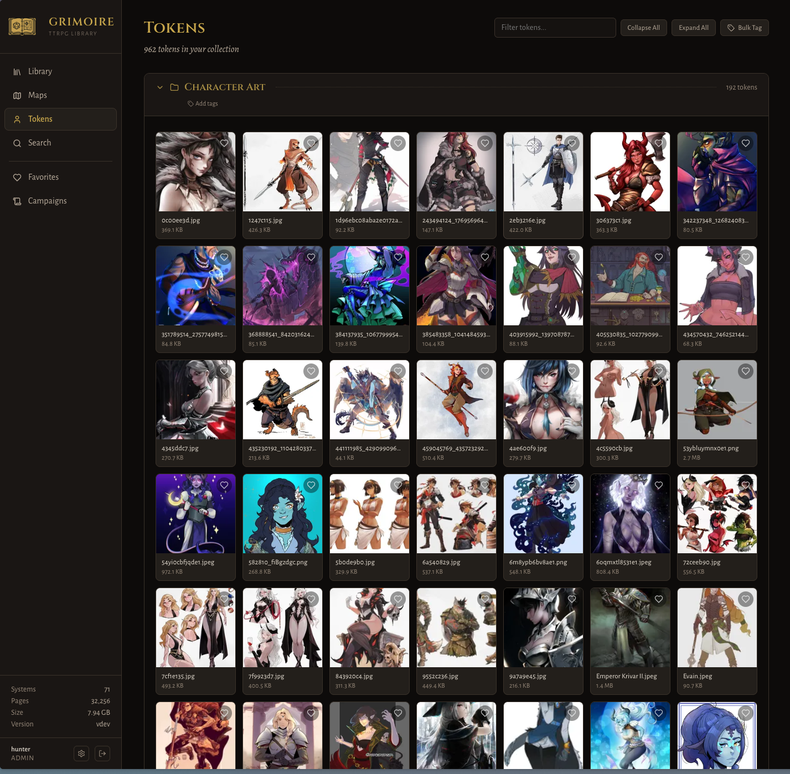
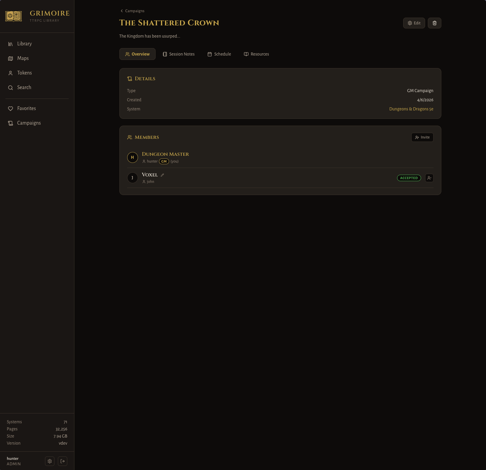
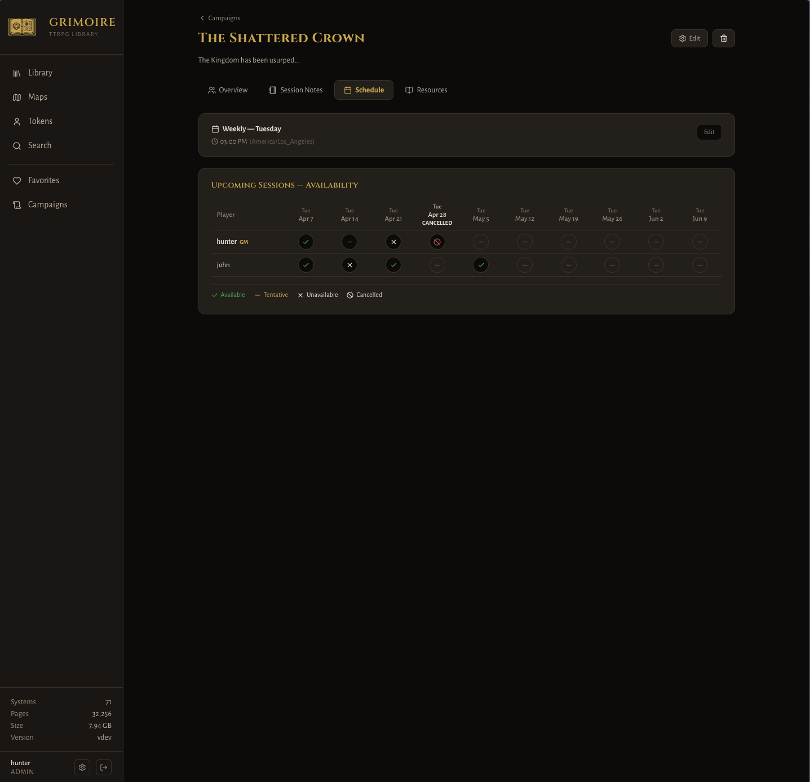

<div align="center">
  

  # Grimoire — Self-Hosted TTRPG Library Manager

  [](https://discord.gg/9Sd4CGZC63)
  [](https://github.com/hunter-read/grimoire/actions/workflows/ci.yml)
  [](https://www.python.org/)
  [](https://react.dev/)
  [](LICENSE)
  [](https://hub.docker.com/r/hunterreadca/grimoire)
</div>


A Docker-based web application for managing your tabletop RPG PDF collection. Browse, search, and read your entire library from any device with a clean, responsive UI.

## Features

- **Library Browser** — Organizes your collection by game system with automatic folder detection
- **Full-Text Search** — Every page of every PDF is indexed with SQLite FTS5 for instant search; also finds maps and tokens by filename, folder, or tag
- **Page-by-Page Viewer** — PDFs rendered as images for fast mobile viewing with pinch-to-zoom, swipe navigation, and spread mode
- **Map Gallery** — Browse battlemaps by directory structure with tag filtering, grid metadata, and full-res download
- **Token Browser** — Browse and tag character tokens and portrait assets
- **Bookmarks** — Per-user page and text-selection bookmarks with inline highlights
- **Favorites** — Save systems, books, maps, and tokens for quick access
- **Metadata Editor** — Add descriptions, tags, genre, publisher links, and character builder URLs
- **Campaigns** — Track GM-run and personal campaigns; session notes, player notes, linked resources, and scheduling
- **OPDS Catalog** — Each user can generate a personal OPDS feed URL to connect e-reader apps directly to their library
- **Docker Ready** — One command to run, mount your library directory, done
- **Responsive** — Works on desktop, tablet, and phone with mobile navigation

---

## Screenshots

| Library | Reader |
|---------|--------|
|  |  |

| Search | Favorites |
|--------|-----------|
|  |  |

| Maps | Tokens |
|------|--------|
|  |  |

| Campaigns | Scheduling |
|-----------|------------|
|  |  |

---

## Quick Start

> New to Docker? See the [Docker Installation Guide](docs/docker-install.md) for a step-by-step walkthrough for Windows, macOS, and Linux.

### 1. Organize your library

Create a `library/` folder with this structure:

```
library/
├── books/
│   └── Dungeons and Dragons 5e/
│       ├── core/
│       │   ├── Players Handbook.pdf
│       │   ├── Dungeon Masters Guide.pdf
│       │   └── monsters/              ← subfolder within a category
│       │       ├── Monster Manual.pdf
│       │       └── Mordenkainen's Monsters.pdf
│       ├── supplements/
│       ├── adventures/
│       │   ├── Curse of Strahd/       ← adventure path subfolder
│       │   │   ├── Curse of Strahd.pdf
│       │   │   └── Strahd DM Screen.pdf
│       │   └── Lost Mine of Phandelver/
│       │       └── Lost Mine of Phandelver.pdf
│       ├── character-sheets/
│       ├── handouts/
│       └── homebrew/
├── maps/
│   └── Sunken Temple (22x22)/
│       ├── Sunken Temple Basement.png
│       └── The Sunken Temple.png
└── tokens/
    └── Monsters/
        └── goblin.png
```

See [Library Structure](#library-structure) for the full layout and category rules.

### 2. Run with Docker Compose

Copy the default compose file, set your `SECRET_KEY`, then start:

```bash
cp docs/docker/docker-compose.yml docker-compose.yml
# Edit docker-compose.yml and set SECRET_KEY and volume paths
docker compose up -d
open http://localhost:9481
```

On first launch you'll be prompted to create an admin account, or you can pre-seed users automatically (see [Pre-seeding users](#pre-seeding-users)).

### 3. Pull from DockerHub

```bash
docker pull hunterreadca/grimoire:latest
```

Or pin to a specific release:

```bash
docker pull hunterreadca/grimoire:1.0.0
```

### 4. Minimal `docker-compose.yml`

```yaml
services:
  grimoire:
    image: hunterreadca/grimoire:latest
    ports:
      - "9481:9481"
    environment:
      SECRET_KEY: "generate-with-openssl-rand-hex-32"
    volumes:
      - /path/to/your/library:/library:ro   # read-only — use Filebrowser or Calibre to manage files
      - /path/to/grimoire/data:/data
```

### 5. Example compose files

Ready-to-use compose files for common setups are in [`docs/docker/`](docs/docker/):

| File | What it runs |
|---|---|
| [`docs/docker/docker-compose.yml`](docs/docker/docker-compose.yml) | Grimoire (default, no extras) |
| [`docs/docker/docker-compose.valkey.yml`](docs/docker/docker-compose.valkey.yml) | Grimoire + Valkey page cache (recommended for large libraries) |
| [`docs/docker/docker-compose.filebrowser.yml`](docs/docker/docker-compose.filebrowser.yml) | Grimoire + Filebrowser Quantum (browser-based file uploads) |
| [`docs/docker/docker-compose.calibre.yml`](docs/docker/docker-compose.calibre.yml) | Grimoire + Calibre full desktop (metadata editing, OPF export) |
| [`docs/docker/docker-compose.calibre-web.yml`](docs/docker/docker-compose.calibre-web.yml) | Grimoire + Calibre-Web (lightweight Calibre browser UI) |

Each file has inline comments explaining the options. Copy and edit the one that fits your setup:

```bash
cp docs/docker/docker-compose.valkey.yml docker-compose.yml
# Edit SECRET_KEY and volume paths, then:
docker compose up -d
```

### 6. Build from source

```bash
docker build --build-arg APP_VERSION=1.0.0 -t grimoire:1.0.0 .
```

---

## Running without Docker

If you prefer to run Grimoire directly on the host, you need Python 3.12+ and Node 20+.

### 1. Build the frontend

```bash
cd frontend
npm install
npm run build
cd ..
```

This produces a `frontend/dist/` directory that the backend serves as static files.

### 2. Install backend dependencies

```bash
pip install -r backend/requirements.txt
```

### 3. Set environment variables

```bash
export SECRET_KEY=$(openssl rand -hex 32)
export LIBRARY_PATH=/path/to/your/library
export DATA_PATH=/path/to/your/data
```

See [Configuration](#configuration) for the full list of environment variables.

### 4. Start the server

```bash
uvicorn backend.main:app --host 0.0.0.0 --port 9481
```

Open `http://localhost:9481`. On first launch you'll be prompted to create an admin account.

### Persistent data

The database, search index, and rendered thumbnails are all stored under `DATA_PATH`. Back this directory up to preserve your library metadata and user accounts.

### Optional: Valkey/Redis page cache

Set `VALKEY_URL` to a Redis-compatible URL to enable in-memory page caching:

```bash
export VALKEY_URL=redis://localhost:6379/0
```

Without it, rendered pages are cached to disk under `DATA_PATH`.

---

## Library Structure

### Books — one folder per game system

Each top-level folder under `books/` becomes a **game system**. Subfolders are auto-detected as categories based on their name.

Folder name matching is **case-insensitive**, and hyphens, underscores, and spaces are interchangeable — `Character-Sheets`, `character_sheets`, and `Character Sheets` all map to the same category.

| Category | Recognized folder names | What goes here |
|---|---|---|
| Core Rulebooks | `core`, `rulebooks`, `rules` | Player handbooks, GM guides, base rules |
| Starter Set | `starter-set`, `starter kit`, `beginner box`, `boxed set`, `essentials` | Starter/beginner boxes, introductory sets |
| Supplements | `supplements`, `sourcebooks`, `expansions` | Sourcebooks, expansions, setting guides |
| Adventures | `adventures`, `modules`, `campaigns` | Published modules, campaigns, one-shots |
| Character Sheets | `character-sheets`, `character sheets`, `charsheets` | Fillable sheets, alternative layouts |
| Handouts | `handouts`, `reference`, `screen` | Reference cards, DM screens, quick-ref sheets |
| Homebrew | `homebrew`, `custom`, `house-rules` | Community/custom content, house rules |

> Files placed directly in a system folder (not in a subfolder) default to the **core** category.
>
> Any subfolder name that doesn't match the recognized keywords becomes its own category, slugified from the folder name. For example, a folder named `Bestiary` becomes the `bestiary` category.
>
> After adding new files, use **Rescan** in the sidebar (or Settings → Maintenance) to pick up the changes.

#### Subfolders within a category

Any category folder can contain named subfolders to group related books together. Grimoire detects these automatically and displays them as collapsible folder groups within the category section — no configuration needed.

```
books/
└── Pathfinder 2e/
    ├── core/
    │   ├── Core Rulebook.pdf          ← ungrouped, shown at top of Core Rulebooks
    │   └── monsters/                  ← subfolder group "Monsters"
    │       ├── Bestiary.pdf
    │       ├── Bestiary 2.pdf
    │       └── Bestiary 3.pdf
    └── adventures/
        ├── Standalone Adventure.pdf   ← ungrouped
        ├── Abomination Vaults/        ← subfolder group "Abomination Vaults"
        │   ├── Ruins of Gauntlight.pdf
        │   ├── Hands of the Devil.pdf
        │   └── Eyes of Empty Death.pdf
        └── Outlaws of Alkenstar/
            └── ...
```

Books without a subfolder are shown ungrouped at the top of their category section, above any subfolder groups. Subfolder groups are collapsible and include a download button for the whole group.

#### System-agnostic collections

Some books don't belong to a single game system — reference material, zines, art books, or rulesets like Ironsworn or Mothership that span multiple systems. Create a folder whose name is one of the recognized system-agnostic names and Grimoire will display its contents in a separate **System-Agnostic** section on the library page, outside the normal game-system grid.

**Recognized folder names** (case-insensitive):

| Folder name | Example |
|---|---|
| `System Agnostic` | `books/System Agnostic/` |
| `Generic` | `books/Generic/` |
| `Any` | `books/Any/` |

Subfolders directly under the agnostic root become **custom category headings** — whatever you name them is what appears in the UI. There is no keyword matching; the folder name is used as-is (slugified).

```
books/
└── System Agnostic/
    ├── Ironsworn/
    │   ├── Ironsworn.pdf
    │   └── Ironsworn Delve.pdf
    ├── OSR Zines/
    │   └── Knock Issue 1.pdf
    └── Art Books/
        └── MCDM Strongholds and Followers.pdf
```

Books placed directly in the root (without a subfolder) appear under an **Uncategorized** heading.

#### Marking a system as explicit

Append `(nsfw)` to the folder name to mark all content in that system as explicit:

```
books/
└── Some Adult Game (nsfw)/
    └── core/
        └── rulebook.pdf
```

Users with explicit content disabled will not see this system or its books.

### Book metadata from OPF files

Grimoire reads [OPF](https://idpf.org/epub/20/spec/OPF_2.0.1_draft.htm) sidecar files to populate book metadata automatically on first scan. OPF files are the format used by [Calibre](https://calibre-ebook.com/) and many other library managers.

#### Supported fields

| OPF element | Book field |
|---|---|
| `dc:title` | Title |
| `dc:creator` (role=aut) | Authors |
| `dc:publisher` | Publisher |
| `dc:date` | Year (4-digit year extracted) |
| `dc:description` | Description (HTML tags stripped) |
| `dc:subject` | Tags (lowercased) |
| `guide/reference[@type='cover']` | Cover image (file is excluded from the book list) |

`dc:contributor` entries (e.g. Calibre's own tool credit) and `dc:identifier` (UUID/ISBN) are intentionally ignored. `dc:language` is parsed but not stored (no matching field).

#### OPF file discovery

The scanner checks two locations for each book file, in priority order:

1. **`<bookname>.opf`** — a sidecar file with the same stem as the PDF, in the same directory. Suits hand-crafted or single-file layouts.
2. **`metadata.opf`** — a file named `metadata.opf` in the same directory. This is the format Calibre uses when it exports each book into its own subfolder.

A typical Calibre export looks like this and is fully supported:

```
books/
└── Dungeons & Dragons/
    └── core/
        ├── Players Handbook/
        │   ├── players_handbook.pdf
        │   ├── metadata.opf
        │   └── cover.jpg          ← skipped (referenced as cover in OPF)
        └── Dungeon Masters Guide/
            ├── dungeon_masters_guide.pdf
            ├── metadata.opf
            └── cover.jpg
```

OPF metadata is only applied when a book is **first indexed**. Edits made via the web UI are not overwritten on subsequent rescans.

### Maps — organize by creator or collection

```
maps/
└── Creator Name/
    └── map-file.png
```

The folder name is shown as a group header in the map gallery.

### Tokens — organize by type

```
tokens/
└── Category/
    └── token-file.png
```

---

## Tagging with tags.json

Drop a `tags.json` file into any `maps/` or `tokens/` folder (or subfolder) to automatically apply tags when the library is scanned. You can also place one inside a game system folder under `books/` to tag the system itself.

`tags.json` is a plain JSON object. Keys are paths resolved relative to the folder the file lives in:

| Key | What gets tagged |
|---|---|
| `"."` | The containing folder (shown as folder tags in the gallery) |
| `"file.png"` | A file in the same folder |
| `"subfolder"` | A subfolder |
| `"subfolder/file.png"` | A file inside a subfolder |

Values are arrays of tag strings.

```json
{
  ".": ["dungeon", "fantasy"],
  "cave-entrance.png": ["cave", "outdoors"],
  "boss-arena": ["combat", "finale"],
  "boss-arena/throne-room.png": ["throne", "indoor"]
}
```

Tags are applied (or updated) every time the library is rescanned. Tags set via the web UI are replaced by the values in `tags.json` on the next scan.

---

## Adding Files to Your Library

Grimoire mounts your library folder **read-only** and never modifies your files. To upload, organize, or remove content, use a companion tool that mounts the same library folder with write access.

Two tools integrate especially well:

- **[Filebrowser Quantum](docs/file-management.md#filebrowser-quantum)** — drag-and-drop file uploads from any browser, no desktop app needed
- **[Calibre](docs/file-management.md#calibre)** — full book management with metadata editing; Grimoire reads the `.opf` sidecar files Calibre writes ([see OPF support](#book-metadata-from-opf-files))

See [docs/file-management.md](docs/file-management.md) for Docker Compose examples for each tool.

After adding files, trigger a **Rescan** in Grimoire (sidebar or Settings → Maintenance) to index the new content.

---

## Configuration

### Environment variables

| Variable | Default | Description |
|---|---|---|
| `SECRET_KEY` | — | **Required.** JWT signing secret. Generate: `openssl rand -hex 32` |
| `WORKERS` | `2` | Number of uvicorn worker processes |
| `LIBRARY_PATH` | `/app/library` | Optional path to your library directory inside the container if not mounted at /app/library |
| `DATA_PATH` | `/app/data` | Optional path for the database, thumbnails, and search cache inside the container if not mounted at /app/data |
| `BASE_URL` | `http://localhost:9481` | Public base URL of this instance. Set this to the URL you use to access Grimoire (e.g. `https://grimoire.example.com`) when running behind a reverse proxy — used to build absolute links in OPDS feeds and other places that need a fully-qualified URL. |
| `VALKEY_URL` | — | Optional Redis-compatible cache URL for rendered page images (e.g. `redis://valkey:6379/0`) |
| `OPDS_ENABLED` | `false` | Optional, Set to `true` to enable the OPDS catalog. See [OPDS](#opds) below. |
| `LOG_LEVEL` | `info` | Optional Console/Docker log verbosity: `debug`, `info`, `warning`, `error`, or `critical`. The in-app Logs tab (Settings → Logs) always captures `debug`-level entries regardless of this setting. |
| `ALLOW_PASSWORD_AUTHENTICATION` | — | Optional, `true` or `false`. When set, pins password authentication on or off and overrides the toggle in Settings → Authentication (the toggle is shown read-only). When unset, the in-app setting is used. First-run admin setup always requires a username and password regardless of this value. |
| `OIDC_*` env vars | — | Optional. Each OIDC setting (`OIDC_ENABLED`, `OIDC_ISSUER_URL`, `OIDC_TOKEN_ISSUER`, `OIDC_AUTHORIZATION_ENDPOINT`, `OIDC_TOKEN_ENDPOINT`, `OIDC_USERINFO_ENDPOINT`, `OIDC_JWKS_URI`, `OIDC_END_SESSION_ENDPOINT`, `OIDC_CLIENT_ID`, `OIDC_CLIENT_SECRET`, `OIDC_SIGNING_ALG`, `OIDC_BUTTON_TEXT`, `OIDC_GROUPS_CLAIM`, `OIDC_PERMISSIONS_CLAIM`, `OIDC_MATCH_BY`, `OIDC_AUTO_LAUNCH`, `OIDC_AUTO_REGISTER`) can be pinned via env. When set, the field is read-only in Settings → Authentication. When unset, the in-app value is used. See [OpenID Connect](#openid-connect) below. |

### Volumes

```yaml
volumes:
  # Your library — read-only is fine, Grimoire never modifies your files
  - /path/to/your/library:/app/library:ro

  # Persistent data (database, thumbnails, page cache)
  - grimoire_data:/app/data
```

---

## Performance

### Indexing

On first startup Grimoire scans the library and indexes every PDF page for full-text search. This can take several minutes for large collections. The index is stored in the data volume and subsequent startups are fast.

Use the **Rescan** button in the sidebar to pick up newly added files, or configure a scheduled rescan in **Settings → Maintenance**.

### Page rendering

PDFs are rendered page-by-page server-side as WebP images rather than streamed as raw files. This keeps the viewer fast on mobile and avoids loading large files into the browser. Switch to the native PDF viewer anytime via the toolbar.

### Caching

Rendered pages are cached to disk by default. Provide a `VALKEY_URL` to use an in-memory Redis-compatible cache instead for faster repeat loads.

---

## Pre-seeding users

Drop a `users.json` file into your data directory before first start and Grimoire will create those accounts automatically. The file is renamed to `users.json.imported` afterwards and never processed again.

### Format

```json
[
  {
    "username": "admin",
    "password": "changeme",
    "role": "admin"
  },
  {
    "username": "gm",
    "password": "$bcrypt-sha256$v=2,t=2b,r=12$...",
    "role": "gm"
  },
  {
    "username": "alice",
    "password": "alicepassword",
    "role": "player",
    "denyExplicit": true
  }
]
```

| Field | Required | Description |
|---|---|---|
| `username` | Yes | Login username |
| `password` | Yes | Plaintext password **or** a pre-hashed `$bcrypt-sha256$` string |
| `role` | No | `admin`, `gm`, or `player` — defaults to `player` if missing |
| `denyExplicit` | No | `true` to restrict explicit content for this user — defaults to `false` |

**Rules:**
- At least one entry must have `"role": "admin"` — the file is rejected otherwise.
- Entries whose username already exists in the database are silently skipped.
- On parse or validation errors the file is left untouched so you can fix and restart.

### Generating a pre-hashed password

Pre-hashing lets you avoid storing plaintext passwords in the JSON file. Grimoire uses passlib's `bcrypt_sha256` scheme:

```bash
python3 -c "from passlib.hash import bcrypt_sha256; print(bcrypt_sha256.hash('yourpassword'))"
```

Copy the output (starts with `$bcrypt-sha256$`) into the `password` field.

### Docker example

```bash
# Place users.json in your data volume before starting
cp users.json.example /path/to/data/users.json
# Edit the file, then:
docker compose up -d
```

---

## User roles

| Role | What they can do |
|---|---|
| `admin` | Everything — user management, app settings, metadata editing, rescan |
| `gm` | Read everything, edit metadata, create GM campaigns |
| `player` | Read-only access, personal campaigns, session notes |

Create additional accounts in **Settings → Users** after logging in as admin.

---

## Campaigns

Grimoire has a built-in campaign tracker with two modes:

- **GM Campaigns** — Created by GMs or admins. Supports player invitations, shared/private resource linking, GM session notes (internal and shared), per-player session notes, and scheduling.
- **Personal Campaigns** — Private to a single user. Notes expand inline per session. No sharing.

Campaign members can set a **character name** per campaign (editable by both the GM and the player). Users can also set a **display name** in Account Settings that appears in place of their username across the app.

### Session scheduling

GM campaigns support recurring session schedules:

- **Weekly** — same day(s) every week
- **Biweekly** — every other week (anchored to a reference date)
- **Monthly** — nth weekday of the month (e.g. "first Friday")
- **Custom** — explicit list of dates

Session note stubs are auto-created the day before each scheduled session. Players can mark their availability for upcoming dates, and the GM can cancel individual dates.

---

## OpenID Connect

Grimoire supports authentication via any OpenID Connect–compliant identity provider (Keycloak, Authentik, Authelia, Auth0, Okta, etc.). This lets you delegate sign-in to your existing IdP and optionally auto-create accounts for new users.

### Configure

Open **Settings → Authentication** as an admin:

1. Set the **Issuer URL** (e.g. `https://idp.example.com/realms/main`) and click **Autopopulate** — the server fetches the IdP's `.well-known/openid-configuration` and fills in the endpoint URLs. You can also paste the full discovery document URL directly (e.g. `https://idp.example.com/realms/main/.well-known/openid-configuration`).
2. Paste the **Client ID** and **Client Secret** issued by your IdP.
3. Register the displayed **Redirect URI** with your IdP. The path is fixed — set `BASE_URL` so the host portion reflects your public origin:
   ```
   https://<your.server.com>/api/auth/openid/callback
   ```
4. Enable **OpenID Connect**.
5. (Optional) Configure:
   - **Token Issuer** — the exact `iss` value your IdP puts in tokens. Leave blank to auto-detect from the discovery document. Set this explicitly if auto-detection fails or if your IdP's issuer differs from the Issuer URL (e.g. Authentik application providers). Can also be set via `OIDC_TOKEN_ISSUER`.
   - **Groups Claim** — name of the OIDC claim that contains the user's groups. When set, roles are assigned from groups named (case-insensitively) `admin`, `gm`, or `player`. Highest level wins; users without any matching group are denied access.
   - **Advanced Permissions Claim** — name of the OIDC claim containing a permissions object for non-admin users. Currently supports `{viewNSFW: bool}`. Missing keys default to `false`. If the entire claim is missing, access is denied.
   - **Match Existing Users By** — link an existing local account to the OIDC subject by email or username on first login. Subsequent logins always match by stable subject claim.
   - **Auto-launch** — automatically redirect to the IdP when visiting `/login`. Append `?autoLaunch=0` to bypass.
   - **Auto-register** — automatically create local accounts on first OIDC login.

Any field can also be pinned via an environment variable (see the table above). Pinned fields are shown read-only in the admin UI.

### Notes

- First-run setup always uses username + password. The OIDC button only appears after the IdP is fully configured.
- Logging out via the in-app menu suppresses the next auto-launch (so you don't bounce straight back to the IdP).
- The login button text is configurable per deployment (e.g. "Sign in with Acme SSO").

---

## OPDS

Grimoire supports the [OPDS 1.2](https://specs.opds.io/opds-1.2) catalog format, allowing e-reader apps (Panels, Chunky, Kybook, KOReader, etc.) to browse and download books directly from your library.

### Enabling OPDS

Set `OPDS_ENABLED=true` and `BASE_URL` to your instance's public URL in your compose file:

```yaml
environment:
  OPDS_ENABLED: "true"
  BASE_URL: "https://grimoire.example.com"
```

### Personal feed URLs

OPDS access is per-user. Each user generates their own opaque feed URL in **Settings → Account → OPDS Feed**. The URL contains a long random token — no username or password is needed by the OPDS client.

- **Enable** — generates a unique feed URL
- **Copy** — copies the URL to the clipboard
- **Regenerate** — issues a new token; the old URL stops working immediately
- **Disable** — revokes the token; the feed URL stops working immediately

### Feed URL structure

```
https://grimoire.example.com/opds/{token}          ← navigation root
https://grimoire.example.com/opds/{token}/all       ← all books
https://grimoire.example.com/opds/{token}/entry/{id}  ← single book
https://grimoire.example.com/opds/{token}/download/{id}  ← file download
```

### Content filtering

The OPDS feed respects each user's explicit-content preference. Users with explicit content disabled will not see explicit books in their feed and cannot download them via OPDS.

---

## API

The live API is self-documented via OpenAPI. With the server running:

| URL | Description |
|-----|-------------|
| `http://localhost:9481/api/docs` | Swagger UI — interactive docs |
| `http://localhost:9481/api/redoc` | ReDoc — readable reference |
| `http://localhost:9481/api/openapi.json` | Raw OpenAPI schema |

---

## FAQ

Common questions and troubleshooting tips are in [docs/faq.md](docs/faq.md).

---

## Contributing

Grimoire is open source and contributions are welcome — bug reports, feature ideas, docs, and code.

See [CONTRIBUTING.md](.github/CONTRIBUTING.md) for full details on reporting issues, submitting pull requests, and setting up a local development environment.

To report a security vulnerability privately, see [SECURITY.md](.github/SECURITY.md).

---

## License

GNU General Public License v3.0 — see [LICENSE](LICENSE) for details.
